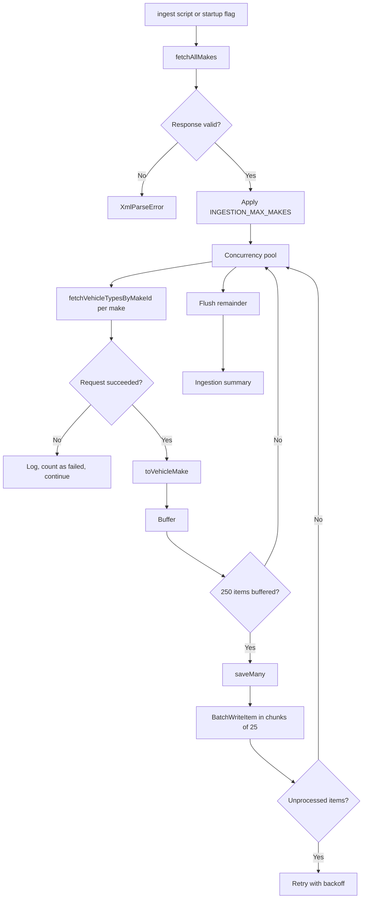
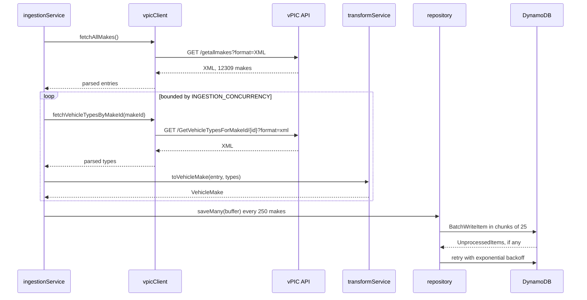

# Architecture

## Layers

The codebase keeps domain logic, infrastructure and presentation apart.

| Layer          | Directories                            | Rule                                                       |
| -------------- | -------------------------------------- | ---------------------------------------------------------- |
| Domain         | `services/`, `models/`                 | Pure logic. No HTTP, no SDK, no database                   |
| Infrastructure | `clients/`, `repositories/`, `config/` | Everything that talks to the outside world                 |
| Presentation   | `graphql/`, `routes/`, `middlewares/`  | Translates HTTP and GraphQL into calls on the layers below |

`transformService.ts` is the clearest example: it takes an object and returns an object,
with no dependency on the network or the database. That is why its tests need no mocks.

## Ingestion pipeline



### Sequence of a full run



### Design decisions

**Bounded concurrency.** Combining makes with vehicle types needs one HTTP request per
make. Running 12,309 of them sequentially would take far too long, and running them all
at once would hammer a public API. `utils/concurrency.ts` keeps exactly
`INGESTION_CONCURRENCY` requests in flight at any moment.

**Incremental persistence.** Data is written every 250 makes rather than once at the end.
A large run takes long enough that losing everything to an interruption is a real risk,
and the rate limit described below makes long runs the normal case. Verified by killing
the process mid-run: the makes already flushed survived.

**Per-make isolation.** A make that fails is logged, counted and skipped. One bad record
out of 12,309 does not abort the run. The summary reports how many succeeded and how many
failed.

**Idempotency.** Persistence uses `PutRequest` keyed by `makeId`, so re-running the
ingestion overwrites rather than duplicating.

## Error handling

Four error classes model the four failure categories, all extending `AppError`, which
carries the original `cause` and a `context` object that ends up in the logs.

| Class                 | Raised when                                                       |
| --------------------- | ----------------------------------------------------------------- |
| `ExternalApiError`    | Network failure, timeout or a non-2xx response from vPIC          |
| `XmlParseError`       | Payload is not valid XML, is empty, or is an HTML error page      |
| `TransformationError` | An entry is missing `Make_ID`, `Make_Name` or a type field        |
| `PersistenceError`    | DynamoDB rejected an operation, or a pagination cursor is corrupt |

### Retry strategy

Only failures that can plausibly succeed on a retry are retried: `403`, `408`, `429`,
`5xx` and network errors. A `404` or a `400` fails immediately, because insisting on them
multiplies the runtime without changing the outcome.

`403` is on that list for a reason specific to this API. vPIC enforces a request quota
per time window and answers `403 Forbidden` once it is exceeded, rather than the
conventional `429`. Measured behaviour: two runs, one at concurrency 20 and one at
concurrency 8, both succeeded for roughly 260 requests and then failed for the remainder,
which points at a quota rather than a concurrency ceiling. Single requests issued after
the run succeed immediately, confirming the block is transient.

Because the client originally classified `403` as an authorisation failure, none of those
requests were retried and 657 makes out of 1,000 were lost in a single run. Reclassifying
it as transient lets the ingestion recover.

Backoff comes in two flavours:

| Situation                              | Delays                  | Ceiling |
| -------------------------------------- | ----------------------- | ------- |
| Ordinary retry, `5xx` or network error | 300 ms, 600 ms, 1200 ms | 5 s     |
| Throttling, `403` or `429`             | 3 s, 6 s, 12 s          | 30 s    |

An ordinary retry recovers from a blip, so a short pause is enough. Throttling needs the
quota window to roll over, and a 300 ms pause only burns another request against the
limit. Every delay carries up to 30% random jitter so that concurrent workers hitting the
limit together do not retry in lockstep and trip it again.

Docker Compose defaults to `INGESTION_CONCURRENCY=3` and `INGESTION_MAX_MAKES=200`.
Measured on a clean run, that combination ingests all 200 makes in 35 seconds with zero
throttled requests. Larger or faster ingestions work, but they spend most of their time
backing off around the limit.

### Failure boundaries

| Failure                      | Behaviour                                                                                                  |
| ---------------------------- | ---------------------------------------------------------------------------------------------------------- |
| Invalid configuration        | Process exits with code `1` before the server starts, listing every problem                                |
| vPIC unreachable             | Retries, then the ingestion fails and reports it. The HTTP server keeps serving whatever is already stored |
| One make fails               | Logged and counted, the run continues                                                                      |
| DynamoDB unreachable         | `PersistenceError`. `npm run ingest` exits with code `1`                                                   |
| Unhandled error in a request | The client gets a generic `500`, the details go to the logs                                                |
| Uncaught exception           | Logged, then the process exits with code `1` so the orchestrator can restart it                            |

Clients never receive stack traces. GraphQL errors are formatted so that domain errors
surface as `extensions.code` and stack traces are stripped from every response, including
the ones GraphQL generates itself.

## Logging

Structured logging with Winston. JSON in production and test, colourised and readable in
development.

Errors are always logged with the same shape:

```typescript
logger.error(error.message, {
  errorMessage: error.message,
  errorName: error.name,
  stack: error.stack,
});
```

Everything reaches stdout, which is what a container orchestrator expects. There is no
file transport to rotate.

### What gets logged

| Event                             | Level   | Notable fields                                                 |
| --------------------------------- | ------- | -------------------------------------------------------------- |
| Startup                           | `info`  | `port`, `env`, `nodeVersion`                                   |
| Shutdown                          | `info`  | `signal`                                                       |
| Schema ready                      | `info`  | —                                                              |
| Table created                     | `info`  | `tableName`                                                    |
| Ingestion started and finished    | `info`  | `concurrency`, `maxMakes`, `persisted`, `failed`, `durationMs` |
| Incremental progress              | `info`  | `persisted`, `failed`, `pending`                               |
| Failed vPIC request               | `warn`  | `url`, `attempt`, `totalAttempts`, `status`                    |
| Unprocessed items                 | `warn`  | `tableName`, `unprocessed`, `attempt`                          |
| Request or transformation failure | `error` | `errorMessage`, `errorName`, `stack`, plus error context       |

Logs are silenced when `NODE_ENV=test` so the test output stays readable.

## Configuration

A single module, `config/index.ts`, reads `process.env`, applies defaults and validates
everything with Joi before the application starts. Nothing else in the codebase reads
`process.env` directly.

```typescript
export function loadConfig(source: NodeJS.ProcessEnv = process.env): AppConfig;
export const config: AppConfig;
```

`loadConfig` is a pure function, which makes it directly testable. `config` is the
validated singleton the rest of the code imports.

Validation runs with `abortEarly: false`, so a bad configuration reports every problem at
once instead of one per restart:

```
Invalid environment configuration:
  - "PORT" must be a valid port
  - "LOG_LEVEL" must be one of [error, warn, info, debug]
  - "INGESTION_CONCURRENCY" must be greater than or equal to 1
```

### Environments

`NODE_ENV` accepts `development`, `test` and `production`, and anything else is rejected.

|                       | `development` | `test`          | `production`                 |
| --------------------- | ------------- | --------------- | ---------------------------- |
| Log format            | Colourised    | JSON            | JSON                         |
| Logging               | Enabled       | Silenced        | Enabled                      |
| GraphQL introspection | Enabled       | Enabled         | Disabled                     |
| Source of values      | `.env`        | `jest.setup.ts` | Environment of the container |

Values are layered: Joi defaults sit at the bottom, `.env` overrides them locally, and
real environment variables win over both. `.env` is never committed; `.env.example`
documents every variable.

DynamoDB credentials are only passed to the SDK when `DYNAMODB_ENDPOINT` is set, meaning
local development. Against real AWS the client falls back to the default credential chain,
so roles and instance profiles work without code changes.
